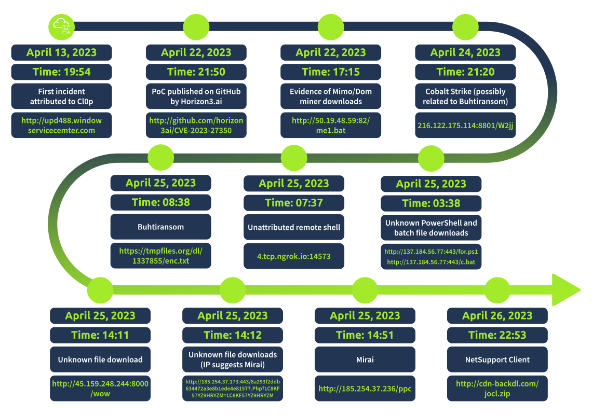

#tryhackme
# Overview

1. PaperCut Overview:
    - Print management software used globally
    - Two self-hosted options: `PaperCut NG` and `PaperCut MF`
    - Unpatched servers being exploited in the wild
2. CVE-2023-27350:
    - Authentication bypass vulnerability
    - Allows unauthenticated remote code execution
    - Linked to `CVE-2023-27351` (information disclosure)
3. Vulnerability Details:
    - Bypasses login page via specific URL request
    - Exploits [Session Puzzling](https://owasp.org/www-project-web-security-testing-guide/latest/4-Web_Application_Security_Testing/06-Session_Management_Testing/08-Testing_for_Session_Puzzling) flaw in `SetupCompleted` class
    - Abuses admin console's scripting functionality
    - Can execute arbitrary JavaScript and Java code
4. Impact:
    - Executes as NT AUTHORITY\SYSTEM (Windows) or root (Linux)
    - Active exploitation by multiple threat actors
    - ~1,700 internet-exposed PaperCut servers (April 2023)
    - Affects educational sector significantly
5. Exploitation:
    - Used by `Cl0p` ransomware group
    - Abuses legitimate IT tools (AnyDesk, Atera, TightVNC, etc.)
    - Deploys various malware (Truebot, Buhtiransom, Mirai, coin miners)
6. Timeline:
    - Vulnerability disclosed and patched in March 2023
    - Active exploitation observed from April 2023 onwards



--------------------
# How it Works
1. Authentication Bypass:
    - The exploit navigates to the vulnerable "/app?service=page/SetupCompleted" page.
    - It then performs a POST request to obtain an admin session token (JSESSIONID).
2. Accessing Script Manager:
    - Using the obtained session, it navigates to the printer's Script Manager.
    - It selects the first printer in the list by default.
3. Code Execution:
    - The exploit embeds the provided command into a JavaScript function.
    - It uses Java's Runtime.exec() to execute the command.
    - The script is updated and executed via a multi-part form submission.
4. Verification:
    - The exploit checks for a "Saved successfully" message in the response to confirm execution.

## Key points:
- The vulnerability stems from installation files persisting after initial setup.
- It allows bypassing authentication and gaining admin access.
- The Script Manager feature for printers is leveraged for remote code execution.
- The exploit runs with SYSTEM privileges, negating the need for privilege escalation.

**To use the exploit:**
```python
python3 CVE-2023-27350.py --url 'http://TARGET_IP:9191' --command "YOUR_COMMAND"
```

<u>Mitigation:</u>
- Update to the latest version of PaperCut MF/NG.
- Follow mitigations in the PaperCut Security Advisory (PO-1216 and PO-1219).