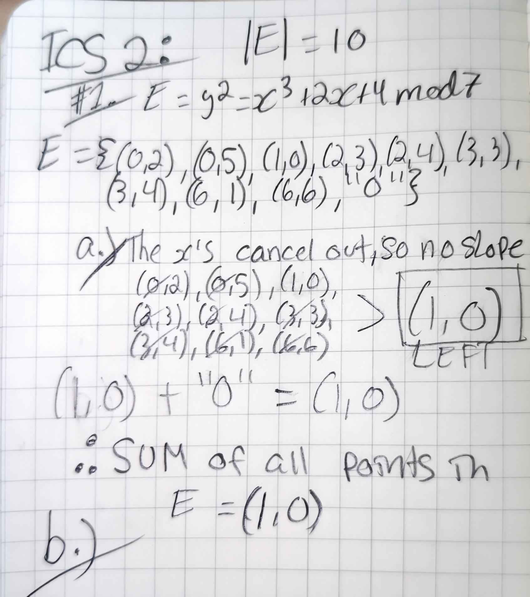

# MATH36206 In-Class Assignment 2

- You may work on this assignment in a group of up to four students.
- Submit this page and attach any manual solutions to it.
- Submit any Jupyter/Python notebooks in html format on SLATE in the In-Class folder.
- Show all relevant steps and explain your answers.

| Student Name     | SLATE Username |
| ---------------- | -------------- |
| Jonathan Marien  | marien         |
| Mohammed Elsayed | elsayemu       |
| Lucas Oppedisano | oppedilu       |

1. For last week’s elliptic curve ${E}$ described by $y^2=x^3+2x+4\bmod7$ we know that |E| = 10 points and:

```
E={(0,2),(0,5),(1,0),(2,3),(2,4),(3,3),(3,4),(6,1),(6,6),“O”}
```

```
a) Sum all the points in E (compute (0,2) + (0,5) + (1,0) + (2,3) +
(2,4) + (3,3) + (3,4) + (6,1) + (6,6) + “O”).
```


```
b) Pick any point P ∈ E (except to “O” point...) and show that when you add it to each point in E this results in a re-arrangement of points.
```


```
c) Use the sum of points and the re-arrangement of points to prove
that 10P= “O” for every single point P∈ E.
```

```python
from ecutils.core import EllipticCurve, Point

# Define the curve y^2 = x^3 + 2x + 4 (mod 7)
# This curve has p=7, a=2, b=4.
# We set a placeholder generator G=Point(0,1), group order n=10, cofactor h=1.
my_curve = EllipticCurve(
    p=7,  
    a=2,  
    b=4,  
    G=Point(0,1),  # placeholder generator
    n=10,         
    h=1
)

# Known points on the curve (excluding the identity O):
points = [
    Point(0, 2),
    Point(0, 5),
    Point(1, 0),
    Point(2, 3),
    Point(2, 4),
    Point(3, 3),
    Point(3, 4),
    Point(6, 1),
    Point(6, 6)
]

# We'll define O as None in our Python code:
O = None

# Helper for adding two points on our curve:
def add_points(P, Q):
    if P is None:
        return Q
    if Q is None:
        return P
    return my_curve.add_points(P, Q)

## Checking our answers from part a)
print("------------------")
print("Part a) answers:")
print("------------------")
# (a) Sum all points in E, including O:
sum_all = O
for pt in points:
    sum_all = add_points(sum_all, pt)

print("Sum of all points =", sum_all)  # should be (1,0)

## Checking our answers from part b)
print("------------------")
print("Part b) answers:")
print("------------------")
# (b) Re-arrangement demo: pick P != O and add it to each point
P = points[0]  # for example, (0,2)
rearranged = [add_points(pt, P) for pt in points]
print("After adding P to each point, we get:")
for r in rearranged:
    print(r)

## This shows our answer for part c)
print("------------------")
print("Part c) answers:")
print("------------------")
# (c) Show that 10P = O for each P in E
def scalar_mult(k, P):
    R = O
    for _ in range(k):
        R = add_points(R, P)
    return R

for pt in points:
    result = scalar_mult(10, pt)
    print(f"10 * {pt} = {result}")
```

```python_output
└─Δ .\script2.py
Sum of all points = Point(x=1, y=0)
After adding P to each point, we get:
Point(x=2, y=4)
Point(x=None, y=None)
Point(x=3, y=4)
Point(x=0, y=5)
Point(x=6, y=6)
Point(x=1, y=0)
Point(x=6, y=1)
Point(x=2, y=3)
Point(x=3, y=3)
10 * Point(x=0, y=2) = Point(x=None, y=None)
10 * Point(x=0, y=5) = Point(x=None, y=None)
10 * Point(x=1, y=0) = Point(x=None, y=None)
10 * Point(x=2, y=3) = Point(x=None, y=None)
10 * Point(x=2, y=4) = Point(x=None, y=None)
10 * Point(x=3, y=3) = Point(x=None, y=None)
10 * Point(x=3, y=4) = Point(x=None, y=None)
10 * Point(x=6, y=1) = Point(x=None, y=None)
10 * Point(x=6, y=6) = Point(x=None, y=None)
```