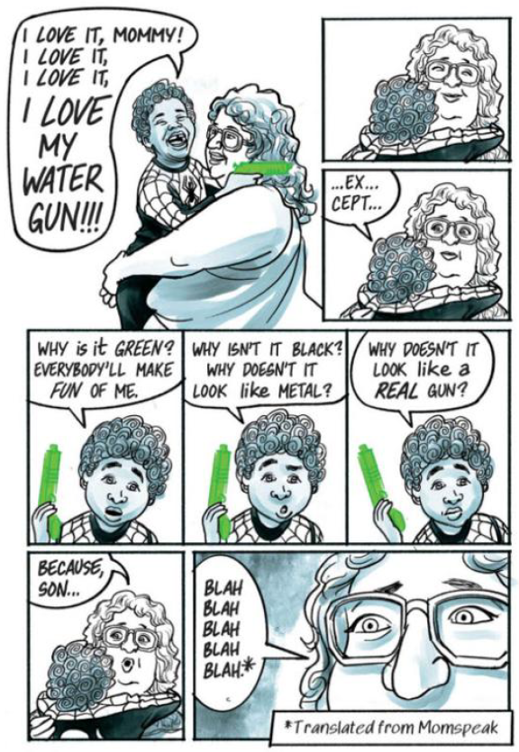
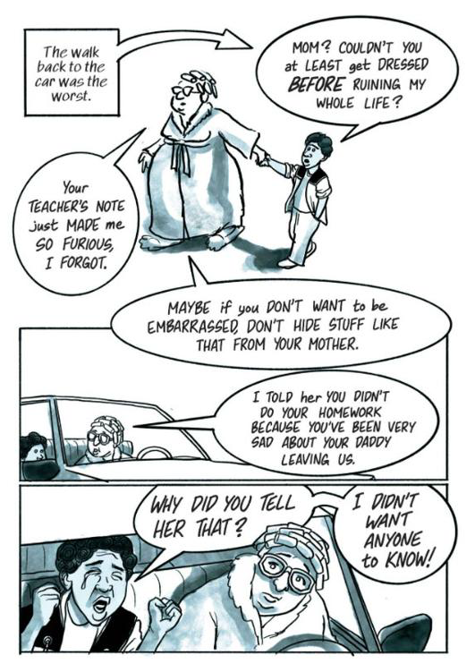

| Title                      | Author                       | Created          | Published        | Tags                   |
| -------------------------- | ---------------------------- | ---------------- | ---------------- | ---------------------- |
| Week 2 - The Talk - Part 1 | <ul><li>Jon Marien</li></ul> | January 18, 2025 | January 18, 2025 | [[#classes\|#classes]] |

# WEEK 2: DARRIN BELL'S _THE TALK_ (2023)

[Image Source](https://sacobserver.com/2023/06/talk-is-deep/)

---
## Estimated Completion Time: 120 minutes

---
## Introduction

Welcome to Week 2!  This week, we will be building upon what we've learned about the genre of graphic memoirs, developing a vocabulary base for talking about comics, and analyzing Darrin Bell's _The Talk_.  

|   |   |
|---|---|
||### Authors vs. Fictive Authors  Before we can get into this module, we need to establish a system to how we will be referring to the authors of these memoirs vs. the fictive authors in the text (which we discussed last week).   In literary studies, it is common to refer to the author by their last name and characters within a text by their first name.  As such, when **referring to the** **authors** throughout this course, I **will use last names**.  When referring to the **fictive authors**--or the protagonists within the memoirs themselves--**I will use the first names**.|

---

## Understanding Comic Pages

Much like we need a common way to distinguish the author from the fictive author, we also need a common language for speaking about and analyzing the memoirs that we will be studying this term.  Watch the following video (00:09:42) for a great overview of the elements of a comic page:

[Video Source](https://youtu.be/7ZZ4dp6nPjE?si=QfyO2iJ7CrQanVgg)

Alright then!  Let's expand upon that overview a bit further and dissect the different elements that go into the composition of a comic page:

> _A sample comic page that identifies various elements: captions, speech balloons, though bubbles, motion lines, sound effects, panels, gutter, and margins._ [Image Source](https://tmotley.com/instruction/)

Think you have this down?  See if you can complete the following crossword activity which covers comic page vocabulary:

|   |   |
|---|---|
|2.png)|> _An interactive crossword puzzle that uses comic page terms_|

---

## _The Talk_ (2023): Background Context

Right! Now that we've gotten some of the language under our belts, let's take a look at _The Talk_.  Published in 2023, this graphic memoir is described by Tahneer Oksman as an exploration of:

> the question of how people — in this case, a precocious, geeky, and artistic young man, the child of a white mother and Black father — know what they know. How can you make sense of the world around you when your lived experiences don't match up with the conflicting things people around you, particularly adults, say or do? ([Oksman 2023](https://www.npr.org/2023/06/08/1180103649/the-talk-is-an-epic-portrait-of-an-artist-making-his-way-through-hardships))

And just to get it out of the way (because I know that at least some of you went and checked 😂), here's what ChatGPT has to say when asked to summarize the book:

> Darrin Bell’s _The Talk_ is a powerful graphic memoir that explores the difficult and often painful conversations Black parents have with their children about racism and personal safety. The book is structured around Bell’s own experiences and the broader cultural context, illustrating the complex dynamics of these "talks" and their impact on families. Through a mix of personal narrative and broader societal commentary, Bell highlights the emotional weight and necessity of these discussions, revealing the resilience and vulnerability involved in navigating a world fraught with racial tensions. The memoir combines poignant storytelling with incisive social commentary, making it both a personal and universal reflection on race, identity, and parental love. (ChatGPT)

And this is all very lovely, but I find that with life writing, it's always best when we can hear/learn about the text from the actual author (whenever possible).  Why?  Because not only does hearing from the author better recognize and honour their lived experiences, but it also stops other people's voices from completely taking over and interpreting the narrative without important biographical context. 

So, below is an interview with Darrin Bell (00:17:44), wherein he discusses getting "the Talk" and how his childhood shaped his development:

[Video Source](https://youtu.be/eVmnSmq4n4A?si=dcSOkFXzdZSGDM5i)

|   |   |
|---|---|
|1.png)|### Video Debrief  See if you can identify some of the key points that of the video in the matching activity below:  _A drag and drop activity based upon the interview with Bell_|

---

## The Prologue: Indelible & Chapter 1: The Talk

The book begins with the Prologue, which is titled _Indelible_.  The word _indelible_ refers to something "that cannot be removed, washed away, or erased" (["Indelible"](https://www.merriam-webster.com/dictionary/indelible)). 

_A screenshot of page 7 of_ The Talk_, which is a splash page that shows two dogs attacking from a first-person POV_

When we analyze texts of any sort, it's important to consider the choices that the author makes when representing ideas or stories on a page.  In the world of graphic memoirs, we get the advantage of being able to look at multiple elements of **comic page composition**:

[Video Source](https://youtu.be/DO7g48W-GzI?si=UNjjcULfohGIK-NL)

In the Prologue splash page of _The Talk_, the reader is experiencing a slightly low-angle shot where the attacking dogs seem to be looming before/over us.  The use of colour (grey-scale) gives the reader a dark feeling, but it's also an incredible metaphor for the black vs. white content that is reflected in the theme of the text.  Take, for example, page 8, wherein Darrin is a black child but is actually coloured/shaded predominantly in grey and white.  An odd design choice for a book about racism, no?

_A screenshot of page 8, which shows a close shot of young Darrin's terrified face_

This use of colour, juxtaposed in the two splash pages, is significant.  As we read the Prologue, we learn that Darrin isn't yet able to make full sense of what he needs to fear in the world.  At six years old, he begins the story as a child who is innocent and naive (though, notably, he does not remain that way not for long).  His innocence seems to be highlighted in the use of white, and the threat of the dogs illustrated through the use of black values on the previous page.  

However, as we progress throughout the graphic memoir, we see Darrin come to the realization that the world is not so "black and white" (literally or figuratively).  Coupled with the meaning of "indelible," prologue provides us with a powerful message: racism will eventually make Darrin's "blackness" known to him, marking him unjustly and inaccurately as a threat (like the blackness of the dogs).  The irony here is, of course, resides in the tension of the role reversal: in Chapter 1, we see that it is the _white police officer_ who poses the larger threat to Darrin, not the black dogs. The dogs become a metaphor for racism, constantly hounding and terrorizing Darrin for no reason other than his skin colour.  Bell underscores this point by portraying the barking police officer as transforming into a snarling dog on page 30 and showing Darrin submitting to the officer on page 33:

_Page 30, which shows the police officer's head transforming into that of the dog that attacked him earlier_

_Page 33: Young Darrin crouches down and holds out his hands to the "dog," who is actually the police officer_

Much like the compositional choices and strategies in this book, racism, too, is a social construct and one that Darrin has to be taught through experience because he didn't listen to "the Talk," which is the subject of Chapter 1:

_Page 18: The title page for Chapter 1, which shows a gun laying in a puddle_ 

And can I just say that I _love_ how Bell has the reader experience his first encounter with racism?  It's masterfully done.  Chapter 1 starts with "the Talk," shifts to an encounter with a white police officer, and then returns to "the Talk."

The first time we see Darrin receiving the Talk, his mother's words are dismissed by a six-year-old boy as "Momspeak" (nagging) on page 23-24.  However, after his encounter with the police officer, his mother's words come back clearly as Darrin seems to internalize her lesson on pages 35-36:

_Pages 23-24: Young Darrin's mother buys him a green squirt gun and gives him a warning about taking it outside.  He decides to ignore her._

_Pages 35-36: Darrin asks his mother why his gun has to be green and his mother explains the concept of prejudice to him, saying that the gun looking like a toy will keep him alive._

Here, Bell uses Chapter 1 to split his life into two parts (almost like comic panels): "before" his first encounter with racism and "after" his first encounter.  You'll notice that his recollections of the Talk are also in two different colour scales: the first is in grey scale and the second is in sepia scale.  Darrin becomes angry--rightly so!--and we see him begin to face his fears of the dogs because he recognizes that they aren't his greatest threat.  He returns home, still clutching the rock, and we see how he and his mother struggle to deal with what Darrin has experienced:

_Pages 39-40: Darrin arrives home after his confrontation with the police officer.  We see him head straight to his room, clutching the rock he picked up for protection._

While his mother recognizes that something is clearly wrong, we see their lived experiences with race starting to divide them: as a white woman, Darrin's mother cannot appreciate fully what he's going through because they no longer experience the same [**shared reality:**](https://www.sciencedirect.com/science/article/abs/pii/S2352250X18302033) "Shared reality is defined as the experience of having in common with others inner states about the world [...] Inner states include the perceived relevance of something, [...] as well as feelings, beliefs, or evaluations of something" (Echterhoff & Tory Higgins 2018). In other words, Darrin's blackness and his mother's whiteness become a point of division between them--not in any sort of malicious way, but because their realities and experiences of the world no long align in the same way.

|   |   |
|---|---|
|3.png)|### Self-Reflection  Why does shared reality amongst communities matter?  What sort of shared realities do you experience?  Can shared realities be dangerous?  Why or why not?|

---

## Chapter 2: Big Lips

In this chapter, we see how Darrin is not only insecure about how he looks (a sentiment to which I think most can relate), but that those insecurities have strong racial underpinnings.  On page 48, there is a representation of what Darrin wants to look like, and he uses the metaphor of [Mr. Potato Head](https://www.museumofplay.org/toys/mr-potato-head/):

_Page 48: An illustration of [Mr. Potato Head](https://en.wikipedia.org/wiki/Mr._Potato_Head) (a children's toy), which has the colour, style, and anatomical features that Darrin wishes to possess_

You will notice that he wants to mimic traits from popular culture and his brother: he wants his brother's height and lips, but also other attributes from famous people.  Interestingly is the allusion to Michael Jackson's white, rhinestone glove: Jackson wore that glove because he suffered from vitiligo--a skin condition in which parts of his skin were turning white.  You can read an interesting article about the whole matter [here](https://timesofindia.indiatimes.com/life-style/fashion/celeb-style/heres-why-michael-jackson-always-wore-one-iconic-white-glove/articleshow/106674990.cms), but point of significance here resides in the [**symbolism**](https://liberalarts.oregonstate.edu/wlf/what-symbolism): encounters between "whiteness" and "blackness" are a constant struggle not just for Darrin, but as we learn in this chapter, for his father as well.

When Darrin learns of how his mother (Karen) and father (Emmett) met each other, his mother describes a terrifying scene where the two are chased by police cars after stopping for gas and snacks.  Darrin recalls the story, noting that during the chase, Karen was "still too naive to be scared," which again draws our attention to the fact that she does not experience a shared reality with her sons or her husband in terms of racial identity:

__

_Page 59: A flashback page that shows Darrin's mother and father being chased by police in a car when they were young adults.  His father is terrified, but his mother is laughing and thinks it's funny._

I find the depiction of Emmett and Karen at the bottom of page 59 to be particularly telling: she's laughing while being chased by the police and Emmett is terrified.  And it is because Darrin can identify with his father (both in terms of gender and race), he turns to Emmett for advice on how to handle a racist bully at school:

_Page 63: Darrin attempts to discuss the "big lips" insult with his father, who refuses to talk about it and leaves the house._

However, it becomes clear that Darrin will not get satisfactory answers from his father.  Instead, Darrin learns that humour can be used as both a defense mechanism and a weapon against bullies:

_Pages 66-67: Darrin illustrates how he learns to make people laugh and turn insults back upon the bullies_

Further, page 66 calls our attention to the crux of the matter for Darrin: he's not fully black, nor fully white.  As such, he doesn't feel that he belongs to either community and thus, struggles to gain a sense of self and personal identity.  By becoming funny and making people laugh, he seeks a way to straddle both communities and find a place for himself.  We should also take note of how the black adults in Darrin's life seem to approve of this strategy, even if they don't say it out loud:

_Page 68: Darrin is being bullied at recess.  He stands up for himself and notices a teacher is watching.  He thinks he will be in trouble, but the teacher only winks at him._ 

|   |   |
|---|---|
|3.png)|### Self-Reflection  Why do you think that Bell includes the implicit approval that Emmett and Mrs. Cass seem to have for using humour to combat racism?  Why do you think that they didn't engage in a more direct conversation with Darrin about the subject?|

---

## Chapter 3: Scenes

In this chapter, we begin to see the role of secrecy in Darrin's life in the things that he hides from others to avoid creating/causing "scenes" (public spectacles).  Even as an older child, Darrin still does not tell his mother about his encounter with the police officer, partially because he fears what she will do if she finds out.  

_Page 71: Darrin's mother discusses how  white people look for any reason to stereotype black people, so Darrin and his brother need to watch their language._

An example of Karen creating a scene is depicted when the boys go shopping with her.  Darrin is watched carefully by a store employee (racially profiled), and already made to feel uncomfortable and self-conscious.  Then, because the cashier makes an inappropriate assumption that the boys are "bothering" Karen, she creates a "scene":

_Pages 78-79: Darrin's (white) mother makes a large scene by yelling in a store when a security officer asks if her black sons are bothering her_

Darrin says that he wants to crawl into a deep, dark hole because he is so embarrassed. And then, suddenly we jump forward by several weeks and return to this idea of secrets:

_Page 80: Darrin tells the reader that he has been keeping many secrets since his parents' divorce, setting the reader up for a suspenseful reveal for later pages.  He gives several examples of the smaller secrets that he has._

_Page 86: Darrin's mother learns that his classwork is being graded unfairly and demands that he come with her to the school_

Darrin claims that he's kept many secrets from his mother "since the divorce" of his parents.  Ironically, this fact is kept secret from us as readers: Darrin gives no indication that there were problems in his parents' marriage until this moment.  Like others on the outside of this family unit, we may _think_ that we understand Darrin, but we have no true idea of what's happening in his life.  I also find it interesting how Bell opts to just casually drop the subject of the divorce into the narrative very casually.  They are now poor, he keeps secrets from his mother... it's almost as if he doesn't want to turn it into (you guessed it!) a _scene_ on the page of the graphic memoir.  Here, form and content mirror each other: Bell literally resists creating a scene that explains the divorce until he can avoid it no longer: the truth comes out from his mother.  It is Karen who creates the metaphorical scene in the book when she confronts Darrin's teacher, and in recounting the story, Bell is forced to address the divorce in the literal scene on the page:  

_Pages 89-90: Darrin's mother tells his teacher that their father abandoned the family.  Darrin is upset because this is a secret that he didn't want anyone outside of his family to know_

_Pages 91- 92: Darrin accidentally informs his mother that a teacher called him a "trouble-maker," and she heads off to the school to make a scene with Darrin in tow._

|   |   |
|---|---|
|3.png)|### Self-Reflection  Have you ever "made a scene"?  If so, what motivated you to behave that way?  If not, why do you think that is?  How do you feel if you see someone else making a scene?  Does it matter _why_ someone is making a scene, or is it always uncomfortable/awkward?|

---

## Chapter 4: All the Way Down

In the fourth (and very short!) chapter, we see Darrin beginning to order and structure his world according to social hierarchies.  The very first page of this chapter depicts the "pecking order" (or the social hierarchy) of different places/spaces in his life:

_Page 94: Four narrow panels on the page that represent the different "worlds" in which Darrin lives: home, classroom, neighborhood streets, and school yard.  Each panel has the following in descending order: a big chicken, a slightly smaller chicken, a chick, and an egg.  Darrin describes the pecking order of the four worlds, in which he is never at the top._ 

|   |   |
|---|---|
|3.png)|### Self-Reflection  Consider the title of this chapter ("All the Way Down") and the content of the first page.  Do you see any [**foreshadowing**](https://liberalarts.oregonstate.edu/wlf/what-foreshadowing) happening here?  What [**themes**](https://www.masterclass.com/articles/the-complete-guide-to-narrative-theme-in-literature-definition-examples-and-writing-how-to) do you anticipate that this chapter might address?|

This chapter gives us some insight into how Darrin sees himself, as per the diagram of social hierarchy that he provides.  You'll notice from his account of the bus conversation that Darrin is _incredibly_ smart--gifted, even, as we know from the fact that he attended a gifted school in his younger years.  Darrin engages in philosophical discussions about theoretical physics on the school bus; and yet, in the second column of his pecking order chart, he places himself at the bottom--notably below the "smart kids":

_The same image as above.  In the second panel, "Shy Kids (Me)" is at the very bottom, depicted by the egg.  "Smart Kids" are represented by the second chicken._

You'll also notice that even though Darrin is talking about being bussed to school, "the bus" does not seem to warrant it's own category in his chart; rather, the bus seems to be an amalgamation of the last three columns (classroom, neighborhood streets, and school yard).  But our skepticism of Darrin's perception of these social hierarchies is reinforced when we learn that Darrin bonds with the other kids while going to an _art_ _museum_, which is not a typical place that one would find unintelligent people spending their time voluntarily.  We see Darrin identify his place in his world (at least for the time being), but we should take note that as a narrator, he's _somewhat_ unreliable because of his bias: he doesn't classify himself as smart, but rather, as shy--you can be both--and thus does not seem to have an accurate or clear sense of self.   

Since this is Darrin's story, we can only go by what Bell chooses to share with us, and this chapter calls our attention to that fact.  However, I would point out that this skewed sense of self-identity is, in some ways, a very authentic and realistic representation of Bell's younger self and one to which many readers will relate.  One's teenage years are often spent trying to figure out who we are and our place in the world (you couldn't _pay_ me to go back to being a teenager!). 

We also see some of remnants of the innocence of youth coming through in how Bell describes the group of boys.  They become "best friends" after one social outing and begin to spend all of their time together:

_Darrin recounts meeting a new friend group.  The boys in the group are from diverse racial backgrounds._

But you will notice that the issue of race is still factoring heavily into Darrin's mindset: he classifies the "popular" or the "_A_ crowd" as being all white.  Despite being surrounded by peers and accepted by them, there is still a sense of "otherness" or of being an "outsider" in the social system.  Even when race and social identity are not the central focus of the chapter, it's still an underlying concern that registers for Darrin as he learns to navigate the world around him.  And in fact, his concern and preoccupation with race _must_ be constant because it helps to keep him safe and navigate an unfair world that judges him for the colour of his skin.  The lessons of his youth continue to come up and have left an indelible mark on Darrin's self-identity.

---

---

**This completes the Week 2 Content Module.  Thank you for participating!**
