| Title            | Author                       | Created      | Published    | Tags                                               |
| ---------------- | ---------------------------- | ------------ | ------------ | -------------------------------------------------- |
| NUMPY and PaNDAS | <ul><li>Jon Marien</li></ul> | May 14, 2025 | May 14, 2025 | [[#classes\|#classes]], [[#INFO40051\|#INFO40051]] |

# NUMPY and PaNDAS

## Python Dictionaries

* Dictionaries are used to store data values in key:value pairs.
* thisdict = {
* "brand": "Ford",
* "model": "Mustang",
* "year": 1964
* }
* get item: x = thisdict["model"]
* update item: thisdict["year"]="2000"
* Add item: thisdict["color"] = "red"
* Remove item: del thisdict["model"]
* access item:
* Reference:
* for x in thisdict.values():
  * print(x)

# Numpy Series

>>> d = {'a': 1, 'b': 2, 'c': 3}

>>> ser = pd.Series(data=d, index=['a', 'b', 'c'])

>>> ser

a   1

b   2

c   3

dtype: int64

The keys of the dictionary match with the Index values, hence the Index

values have no effect.

>>> d = {'a': 1, 'b': 2, 'c': 3}

>>> ser = pd.Series(data=d, index=['x', 'y', 'z'])

>>> ser

x   NaN

y   NaN

z   NaN

dtype: float64

# Reading data using pandas

_In [ ]:_

_#Read csv file_

df = pd.read_csv( _"http://rcs.bu.edu/examples/python/_  _data_analysis_  _/Salaries.csv"_ )

_Note: _  _The above command has many optional arguments to fine-tune the data import process._

There is a number of pandas commands to read other data formats:

pd.read_excel('myfile.xlsx',sheet_name='Sheet1', index_col=None, na_values=['NA'])

pd.read_stata('myfile.dta')

pd.read_sas('myfile.sas7bdat')

pd.read_hdf('myfile.h5','df')

# Exploring data frames

_In [3]:_

_#List first 5 records_

df.head()

Out[3]:

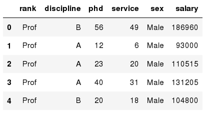

| __Pandas Type__ | __Native Python Type__ | __Description__ |
| :-: | :-: | :-: |
| object | string | The most general dtype. Will be assigned to your column if column has mixed types (numbers and strings). |
| int64 | int | Numeric characters. 64 refers to the memory allocated to hold this character. |
| float64 | float | Numeric characters with decimals. If a column contains numbers and NaNs(see below), pandas will default to float64, in case your missing value has a decimal. |
| datetime64, timedelta[ns] | N/A (but see the [datetime](http://doc.python.org/2/library/datetime.html) module in Python’s standard library) | Values meant to hold time data. Look into these for time series experiments. |

# Data Frame data types

# Data Frame data types (cont.)

_In [4]:_

_#Check a particular column type_

df _[_ 'salary' _]_ .dtype

Out[4]: dtype('int64')

_In [5]:_

_#Check types for all the columns_

df.dtypes

Out[4]:

object

object

int64

int64

object

int64

rank

discipline

phd

service

sex

salary

dtype: object

# Data Frames attributes

Python objects have  _attributes_  and  _methods_ .

| df.attribute | description |
| :-: | :-: |
| dtypes | list the types of the columns |
| columns | list the column names |
| axes | list the row labels and column names |
| ndim | number of dimensions |
| size | number of elements |
| shape | return a tuple representing the dimensionality |
| values | numpy representation of the data |

# Data Frames methods

Unlike attributes, python methods have  _parenthesis._

All attributes and methods can be listed with a  _dir_  _() _ function:  _dir_  _(_  _df_  _)_

| df.method() | description |
| :-: | :-: |
| head( [n] ), tail( [n] ) | first/last n rows |
| describe() | generate descriptive statistics (for numeric columns only) |
| max(), min() | return max/min values for all numeric columns |
| mean(), median() | return mean/median values for all numeric columns |
| std() | standard deviation |
| sample([n]) | returns a random sample of the data frame |
| dropna() | drop all the records with missing values |

# Selecting a column in a Data Frame

_Method 1:   _ Subset the data frame using column name:

df['sex']

_Method 2_ :   Use the column name as an attribute:

df.sex

_Note:_  there is an attribute  _rank_  for pandas data frames, so to select a column with a name "rank" we should use method 1.

Presentation title

# Group Aggregation

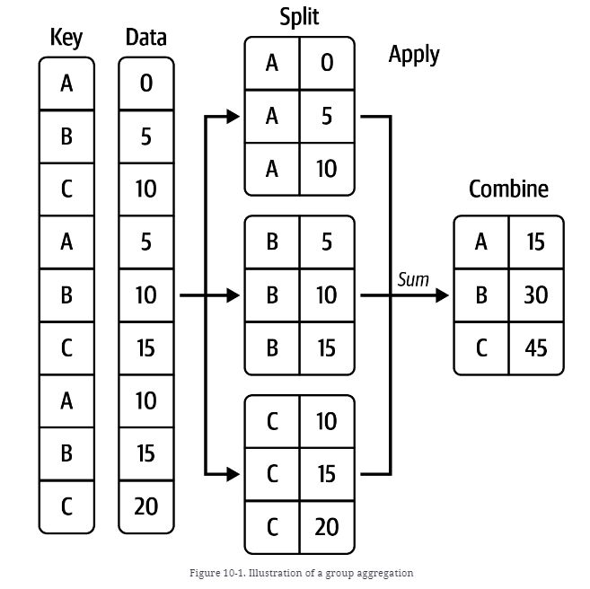

df.groupby([key])[[‘Data’]].sum()

# Data Frames groupby

* Using "group by" method we can:
  * Split the data into groups based on some criteria

_In [ ]:_

_#Group data using rank_

df_rank = df.groupby( _[_ 'rank' _])_

_In [ ]:_

_#Calculate mean value for each numeric column per each group_

df_rank.mean()

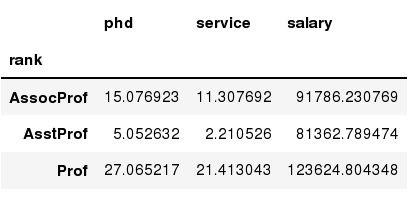

# Data Frames groupby method

Once groupby object is create we can calculate various statistics for each group:

_In [ ]:_

_#Calculate mean salary for each professor rank:_

df.groupby('rank')[['salary']].mean()

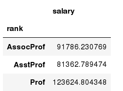

_Note:_  If single brackets are used to specify the column (e.g. salary), then the output is Pandas Series object. When double brackets are used the output is a Data Frame

# Data Frames groupby method (cont.)

* _groupby_  performance notes:
  * - no grouping/splitting occurs until it's needed. Creating the  _groupby_  object only verifies that you have passed a valid mapping
  * - by default the group keys are sorted during the  _groupby_  operation. You may want to pass sort=False for potential speedup:

_In [ ]:_

_#Calculate mean salary for each professor rank:_

df.groupby(['rank'], sort= _False_ )[['salary']].mean()

Presentation title

# Group Aggregation Example

https://pandas.pydata.org/docs/reference/api/pandas.DataFrame.groupby.html#

# Data Frame: filtering

To subset the data we can apply Boolean indexing. This indexing is commonly known as a filter.  For example if we want to subset the rows in which the salary value is greater than $120K:

_In [ ]:_

_#Calculate mean salary for each professor rank:_

df_sub = df[ df['salary'] > 120000 ]

Any Boolean operator can be used to subset the data:

>   greater;     >= greater or equal;

<   less;           <= less or equal;

== equal;        != not equal;

_In [ ]:_

_#Select only those rows that contain female professors:_

df_f = df[ df['sex'] == 'Female' ]

# Data Frames: Slicing

* There are a number of ways to subset the Data Frame:
  * one or more columns
  * one or more rows
  * a subset of rows and columns
  * Rows and columns can be selected by their position or label

# Data Frames: Slicing (cont.)

When selecting one column, it is possible to use single set of brackets, but the resulting object will be  a Series (not a DataFrame):

_In [ ]:_

_#Select column salary:_

df['salary']

When we need to select more than one column and/or make the output to be a DataFrame, we should use double brackets:

_In [ ]:_

_#Select column salary:_

df[['rank','salary']]

# Data Frames: Selecting rows

If we need to select a range of rows, we can specify the range using ":"

_In [ ]:_

_#Select rows by their position:_

df[10:20]

Notice that the first row has a position 0, and the last value in the range is omitted:

So for 0:10 range the first 10 rows are returned with the positions starting with 0 and ending with 9

# Data Frames: method loc

If we need to select a range of rows, using their labels we can use method loc:

_In [ ]:_

_#Select rows by their labels:_

df_sub.loc[ _10:20_ ,['rank','sex','salary']]

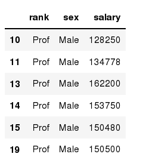

Out[ ]:

# Data Frames: method iloc (cont.)

If we need to select a range of rows and/or columns, using their positions we can use method iloc:

_In [ ]:_

_#Select rows by their labels:_

df_sub.iloc[ _10:20_ ,[ _0, 3, 4, 5_ ]]

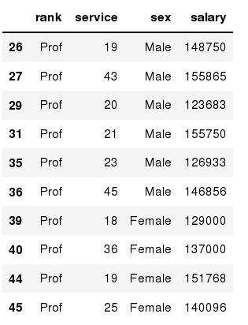

Out[ ]:

# Data Frames: method iloc (summary)

df.iloc[ _0_ ]   _# First row of a data frame_

df.iloc[ _i_ ]   _#(i+1)_  _th_  _ row _

df.iloc[ _-1_ ]  _# Last row _

df.iloc[:,  _0_ ]   _# First column_

df.iloc[:,  _-1_ ]  _# Last column _

df.iloc[ _0:7_ ]        _#First 7 rows _

df.iloc[ _:, 0:2_ ]     _#First 2 columns_

df.iloc[ _1:3, 0:2_ ]   _#Second through third rows and first 2 columns_

df.iloc[[ _0,5_ ] _, _ [ _1,3_ ]]   _#1_  _st_  _ and 6_  _th_  _ rows and 2_  _nd_  _ and 4_  _th_  _ columns_

# Data Frames: Sorting

We can sort the data by a value in the column. By default the sorting will occur in ascending order and a new data frame is return.

_In [ ]:_

_# Create a new data frame from the original sorted by the column Salary_

df_sorted = df.sort_values( by _ =_ 'service')

df_sorted.head()

Out[ ]:

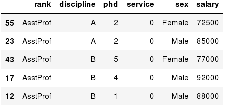

# Data Frames: Sorting (cont.)

We can sort the data using 2 or more columns:

_In [ ]:_

df_sorted = df.sort_values( by _ =[_ 'service', 'salary'], ascending = [ _True_ ,  _False_ ])

df_sorted.head( _10_ )

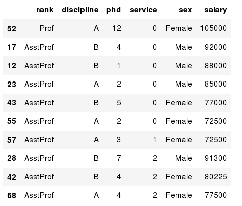

Out[ ]:

# Missing Values

Missing values are marked as NaN

_In [ ]:_

_# Read a dataset with missing values_

flights = pd.read_csv("http://rcs.bu.edu/examples/python/data_analysis/flights.csv")

_In [ ]:_

_# Select the rows that have at least one missing value_

flights[flights.isnull().any(axis=1)].head()

Out[ ]:

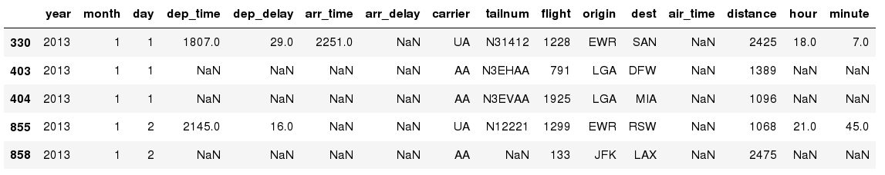

# Missing Values (cont.)

There are a number of methods to deal with missing values in the data frame:

| df.method() | description |
| :-: | :-: |
| dropna() | Drop missing observations |
| dropna(how='all') | Drop observations where all cells is NA |
| dropna(axis=1, how='all') | Drop column if all the values are missing |
| dropna(thresh = 5) | Drop rows that contain less than 5 non-missing values |
| fillna(0) | Replace missing values with zeros |
| isnull() | returns True if the value is missing |
| notnull() | Returns True for non-missing values |

# Missing Values (cont.)

When summing the data, missing values will be treated as zero

If all values are missing, the sum will be equal to NaN

cumsum() and cumprod() methods ignore missing values but preserve them in the resulting arrays

Missing values in GroupBy method are excluded

Many descriptive statistics methods have  _skipna_  _ _ option to control if missing data should be excluded . This value is set to  _True _ by default

# Aggregation Functions in Pandas

* Aggregation - computing a summary statistic about each group, i.e.
  * compute group sums or means
  * compute group sizes/counts
* Common aggregation functions:
  * min, max
  * count, sum, prod
  * mean, median, mode, mad
  * std, var

# Aggregation Functions in Pandas (cont.)

* agg() method are useful when multiple statistics are computed per column:

_In [ ]:_

flights[['dep_delay','arr_delay']].agg(['min','mean','max'])

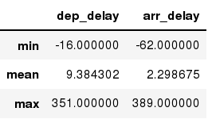

Out[ ]:

# Basic Descriptive Statistics

| df.method() | description |
| :-: | :-: |
| describe | Basic statistics (count, mean, std, min, quantiles, max) |
| min, max | Minimum and maximum values |
| mean, median, mode | Arithmetic average, median and mode |
| var, std | Variance and standard deviation |
| sem | Standard error of mean |
| skew | Sample skewness |
| kurt | kurtosis |

# Graphics to explore the data

Seaborn package is built on matplotlib but provides high level interface for drawing attractive statistical graphics, similar to ggplot2 library in R. It specifically targets statistical data visualization

To show graphs within Python notebook include inline directive:

_In [ ]:_

%matplotlib inline

# Graphics

|  | description |
| :-: | :-: |
| distplot | histogram |
| barplot | __estimate of central tendency for a numeric variable__ |
| violinplot | __ similar to boxplot, also shows the probability density of the data__ |
| jointplot | Scatterplot |
| regplot | Regression plot |
| pairplot | Pairplot |
| boxplot | boxplot |
| swarmplot | categorical scatterplot |
| factorplot | General categorical plot |

# Basic statistical Analysis

* statsmodel and scikit-learn - both have a number of function for statistical analysis
* The first one is mostly used for regular analysis using R style formulas, while   scikit-learn is more tailored for Machine Learning.
* statsmodels:
  * linear regressions
  * ANOVA tests
  * hypothesis testings
  * many more ...
* scikit-learn:
  * kmeans
  * support vector machines
  * random forests
  * many more ...
* See examples in the Tutorial Notebook

Presentation title

# Pandas Merge

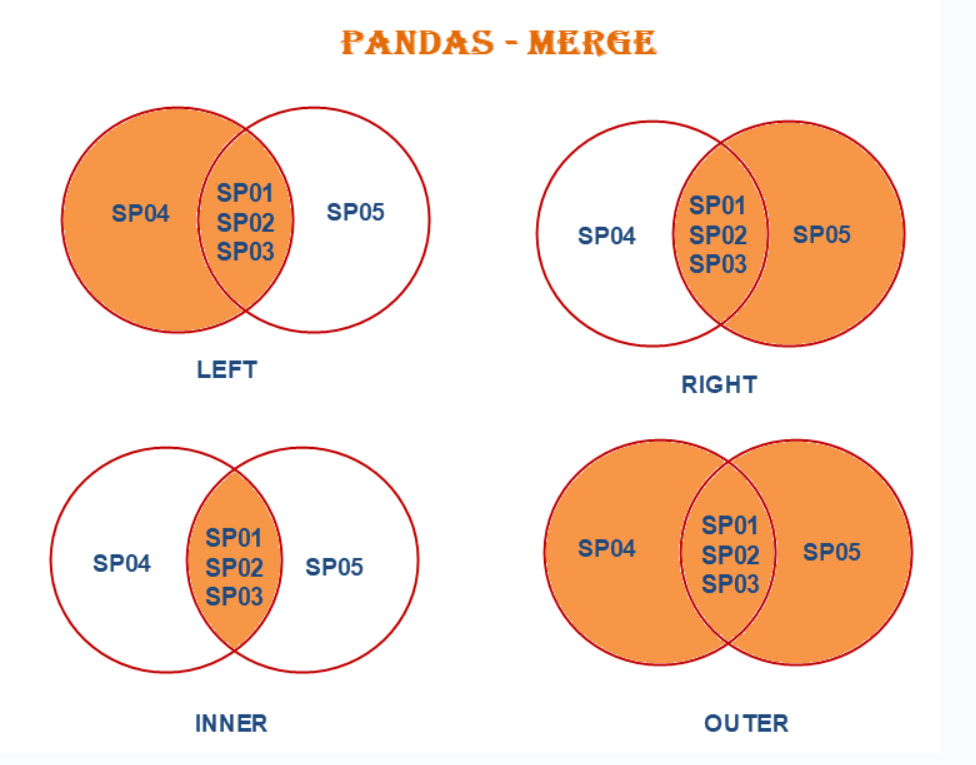

Presentation title

# Merge Example

Example by https://pandas.pydata.org/docs/reference/api/pandas.DataFrame.merge.html

Presentation title

# References

Book: McKinney, Wes.  _Python for data analysis_ " O'Reilly Media, Inc.", 2022.

https://learning.oreilly.com/library/view/python-for-data/9781098104023/ch10.html#groupby_mech_iteration

