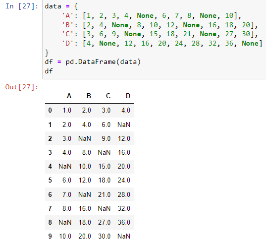

| Title            | Author                       | Created      | Published    | Tags                                               |
| ---------------- | ---------------------------- | ------------ | ------------ | -------------------------------------------------- |
| Data Preparation | <ul><li>Jon Marien</li></ul> | May 21, 2025 | May 21, 2025 | [[#classes\|#classes]], [[#INFO40051\|#INFO40051]] |

# Data Preparation, Data Quantization, Missing Values, Outliers

# Week3

# The goal of data preparation

* Preparing data for data analysis:
  * Data mining
  * Categorization
  * Anomaly detection,…

# Some of the data preparation topics

Data cleaning: Handling missing values, dealing with outliers, and correcting data errors.

Data transformation: Normalization, standardization, log-transformations, scaling.

Data encoding: Converting categorical variables into numerical representations.

Handling date and time data: Extracting meaningful information from dates and times.

Text data preprocessing: Cleaning and preprocessing text data for natural language processing (NLP) tasks.

Data integration: Combining data from multiple sources into a single dataset.

Data normalization: Bringing all features to a similar scale to avoid bias.

# Some of the data preparation topics (cont.)

Handling noisy data: Techniques to reduce noise and improve data quality.

Handling duplicates: Identifying and removing duplicate records in a dataset.

Data discretization: Converting continuous variables into discrete intervals.

Handling skewed data: Techniques to address skewed distributions.

Data sampling: Techniques for selecting representative subsets of data.

Data splitting: Dividing data into training, validation, and testing sets.

Data aggregation: Combining data at a higher level of granularity.

Handling time series data: Techniques for analyzing and preprocessing time-dependent data.

# Data encoding

# Data encoding (cont.)

* Quantize the values:
  * string to integers
  * Date to days
  * Event numbers,….
* To be able to use the data for mathematical machine learning algorithms
* Approaches:
  * Map every string to a number,
  * One-hot encoding,
  * …

# Mapping to a value

For example, in NVD cve vulnerability dataset, you can map attack_complexity values to a numbers


# One-hot encoding

One-hot encoding is a technique used to represent categorical variables as binary vectors. In machine learning, many algorithms require input data to be in numerical format. However, categorical variables, such as gender, country, or browser type, are typically represented as strings or labels.

One-hot encoding transforms each categorical variable into a new set of binary variables, where each variable represents a unique category from the original variable. The process involves creating new binary variables (often referred to as dummy variables) equal to the number of unique categories in the original variable.

One-hot encoding allows machine learning algorithms to understand and effectively use categorical data. It ensures that the categorical variables are encoded in a format that captures the categorical information without imposing an arbitrary numerical order or magnitude on the categories.

# One-hot encoding (cont.)

Here's an example to illustrate the concept. Let's say we have a categorical variable "Color" with three categories: Red, Green, and Blue.

After applying one-hot encoding, the variable would be transformed into three binary variables: "Color_Red," "Color_Green," and "Color_Blue."

The value of each binary variable indicates whether a specific category is present for each observation.

For example, if an observation originally had the color "Red," the variables "Color_Red" would be 1, while "Color_Green" and "Color_Blue" would be 0.


Exercise: Use one-hot to quantize the value of attack_complexity in nvd vulnerability dataset.

# Question

Among the various algorithms you have learned in the field of security, can you remember a method that can be employed for quantizing, which involves mapping strings to numbers?

https://en.wikipedia.org/wiki/Feature_hashing

---

Hashing Algorithms

# Data Cleaning-Missing values

# What is missing values



Whenever the value of a variable (feature/ column ) in a dataset is not provided.

In the Pandas dataframe it is usually represented as NAN or null.

# How to handle missing values?

* __Drop__  the rows with missing values
  * May end up dropping a large number of rows (which in fact represent an object or an event)
  * dataframe.dropna()
  * [https://pandas.pydata.org/docs/reference/api/pandas.DataFrame.dropna.html](https://pandas.pydata.org/docs/reference/api/pandas.DataFrame.dropna.html)
* Replace the missing values with an  __imputed__  value: an estimated value

# Mean/median Imputation

Replace missing values with the  __mean or median __ of the available values in the same column.

This approach assumes that the missing values are missing at  __random__  and that the mean or median is a representative value for the variable.

Find rows with missing values:

```python
await micropip.install("pandas")
import pandas as pd

cve_df= pd.read_csv("nvd_cve_2022_v2.csv")

missing_rows = cve_df[cve_df['column_name'].isnull()]
```

Fill in the missing values with mean
```python
mean_value = df['column_name'].mean()[0]

df['column_name'].fillna(mean_value,inplace=True)
```

__Exercise__ : Please refer to the module 4 notebook to practice filling in the missing base_score of NVD vulnerabilities with the mean value.

# Mode imputation

Replace missing categorical values with the mode (most frequent value) of the available values in the same column.

This approach is suitable for categorical variables.

You can find the rows with the missing values by:

Exercise: Please refer to the module 4 notebook to practice filling in the missing exploitability_score of NVD vulnerabilities with the mode value.


# K-nearest neighbors (KNN) imputation


Replace missing values with values from the nearest neighbors.

The algorithm identifies the k most similar records or observations based on other variables and uses their values to fill in the missing values.

# K-nearest neighbors (KNN) imputation (cont.)


# K-nearest neighbors (KNN) imputation (cont.)

Exercise: Please refer to the module 4 notebook to practice filling in the missing attack_complexity of NVD vulnerabilities with the KNN value.

Note that you first need to quantize the attack_complexity values.

# Other approaches to handling missing values

Regression imputation: Predict missing values using regression models based on other variables. Missing values are treated as the dependent variable, and the other variables are used as predictors to estimate the missing values.

Hot-deck imputation: Replace missing values with values randomly selected from similar records or observations in the same dataset. This approach maintains the statistical properties of the original dataset.

Multiple imputation: Generate multiple imputations by creating multiple plausible values for each missing entry. Multiple imputation takes into account the uncertainty associated with missing values and provides a range of plausible values for analysis.

Domain-specific imputation: Use domain knowledge or expert input to impute missing values based on specific characteristics or patterns in the data.

# Outliers

# Outliers? (cont.)

Data preparation needs to take care of outliers

Outliers are observations that are noticeably different or inconsistent with the general pattern or distribution of the data.

These data points may be extremely high or low values or exhibit unusual behavior compared to the rest of the dataset.

Robust models: Certain machine learning algorithms are inherently robust to outliers, such as decision trees, random forests, and support vector machines with robust kernels. These models are less affected by the presence of outliers in the data.


# Handling outliers: Removing

* The basic approach to handling outliers is to remove them from the dataset.
* How to identify the outliers? What is the threshold to call a point, outlier?
  * Using Standard Deviation
  * Local Outlier Factor (LOF): LOF calculates the local density of a data point relative to its neighbors. Outliers are identified as points with significantly lower local density compared to their neighbors.
  * And many more approaches

# Detecting outlier by Standard Deviation

# Standard Deviation (STD)?


The standard deviation is the average amount of variability in your dataset. It tells you, on average, how far each value lies from the mean.

# High vs LOW SD


Low standard deviation means data are clustered around the mean, and high standard deviation indicates data are more spread out.

# Outlier based on Standard Deviation


# Using Standard Deviation to find outliers

To find outliers using the standard deviation method, you can follow these steps:

Calculate the mean (average) of your dataset.

Calculate the standard deviation of the dataset.

Determine a threshold for identifying outliers. A common threshold is to consider any data point that falls more than a certain number of standard deviations away from the mean as an outlier. The specific threshold is subjective and depends on the nature of your data and the context of your analysis. Typically, a value of 2 or 3 standard deviations is used as a threshold.

Identify the outliers. Any data point that falls above or below the threshold you determined in step 3 is considered an outlier.

# Python code for outliers detected by STD


# Outliers as Anomalies

* Outlier detection approaches can be used for anomaly detection in security applications.
* For example, by monitoring the frequency of user logins and applying the outlier algorithm, you can flag potential anomalies that could indicate suspicious or unauthorized activities.
* Exercise: In the dataset test.jsonl:
  * Map the column “events” dictionary to a new columns
  * Change the format of the columns ‘ts’ to date
  * Find the number of sessions per day for every user
  * Find the outliers for large number of logins per day

# Detecting Outliers by Local Outlier Factor (LOF)

# Local Outlier Factor

The Local Outlier Factor (LOF) algorithm measures the degree to which a data point stands out from its local neighborhood, allowing the identification of outliers or anomalies in the dataset.

The LOF algorithm provides a measure of the outlierness for each data point, allowing you to rank them based on their degree of deviation from the local density. Higher LOF values indicate stronger outliers, while LOF values close to 1 suggest that a data point is similar to its neighbors.

By applying the LOF algorithm to a dataset, you can identify anomalous data points that exhibit unusual patterns or behaviors compared to their local surroundings. This makes LOF a useful tool for anomaly detection and outlier analysis in various domains.


# LOF for anomaly detection

Compare the two figures for outlier detection based on STD and LOF !

LOF is better at detecting anomalies because it checks by the neighbors and if the data change over time, it will consider that change.

For example, if the number of sessions per user per day changes on weekends in comparison to weekdays it will be considered.

