| Title                                 | Author                       | Created      | Published    | Tags                                               |
| ------------------------------------- | ---------------------------- | ------------ | ------------ | -------------------------------------------------- |
| Intro to Machine Learning with Python | <ul><li>Jon Marien</li></ul> | May 28, 2025 | May 28, 2025 | [[#classes\|#classes]], [[#INFO40051\|#INFO40051]] |
# Week 4

### Topics to be covered…..

_Goal of this module: learn the general concept of machine learning and its components. Later in the following modules, we will go through the details of the components._

- _Introduction to Machine Learning_
- _Supervised Learning_
- _Unsupervised Learning_
- _Python libraries for Machine Learning_

## What is Machine Learning?

__The capability of Artificial Intelligence systems to learn by extracting patterns from data is known as Machine Learning.__

Machine Learning is an idea to learn from examples and experience, without being explicitly programmed. Instead of writing code, you feed data to the generic algorithm, and it builds logic based on the data given.

## Traditional Programming vs Machine learning

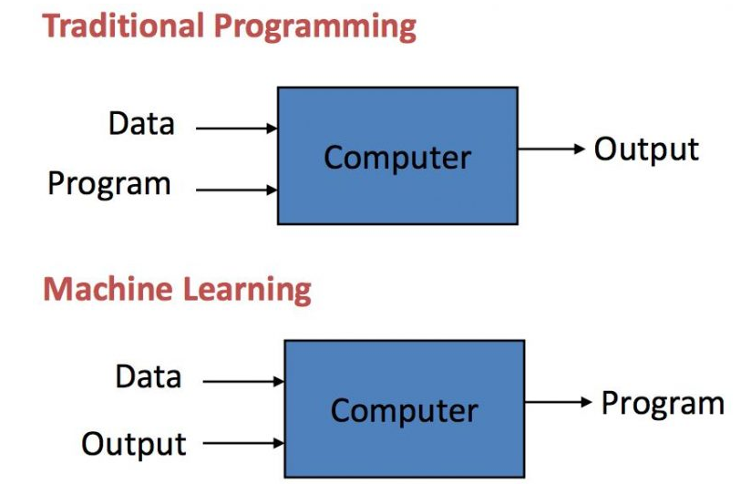

## Traditional programming overview

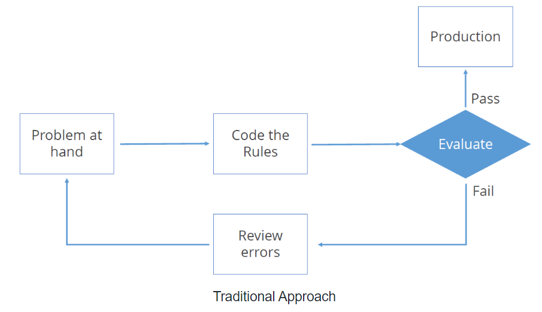

traditional programming relies on hard-coded rules

## Machine learning overview

Machine learning relies on learning pattern from sample data

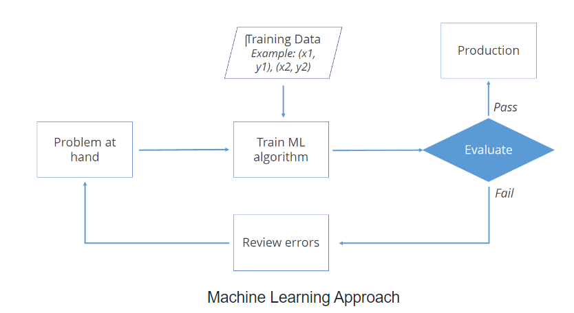

## Machine Learning (ML)

__Machine Learning (ML)__ is an automated learning with little or no human intervention. It involves programming computers so that they learn from the available inputs. The main purpose of machine learning is to explore and construct algorithms that can learn from the previous data and make predictions on new input data.

### So what the machine learning is…

- _Automating automation_
- _Getting computers to program themselves_
- _Let the data do the work instead!_

## Growth of Machine Learning

* __Machine learning is the preferred approach to__
  * Speech recognition, Natural language processing
  * Computer vision
  * Medical outcomes analysis
  * Robot control
  * Computational biology

## Growth of Machine Learning (cont.)

* __This trend is accelerating__
  * Improved machine learning algorithms
  * Improved data capture, networking, faster computers
  * Software too complex to write by hand
  * New sensors / IOT devices
  * Demand for self-customization to user, environment

## Applications of Machine Learning Algorithms

- Web search 
- Computational biology
- Finance
- E-commerce
- Space exploration
- Robotics
- Information extraction
- Social networks
- Debugging
- Data mining
- Expert systems
- Robotics
- Vision processing
- Language processing
- Forecasting things like stock market trends, weather
- Pattern recognition
- Games
      [Your favorite area]

## Benefits of Machine Learning

- __Powerful Processing__
- __Better Decision Making & Prediction__
- __Quicker Processing__
- __Accurate__
- __Affordable Data Management__
- __Inexpensive__
- __Analyzing Complex Big Data__

## Steps Involved in Machine Learning

* A machine learning project involves the following steps:
  * Defining a Problem
  * Preparing Data
  * Evaluating Algorithms
  * Improving Results
  * Presenting Results

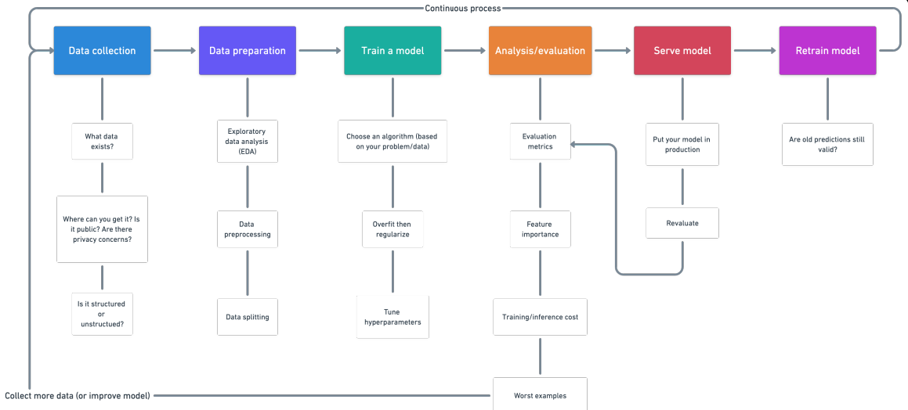

- __Test/Train dataset with quantized features__
- __Evaluated Model with high accuracy__
- __recall__
- __f-measure__
- __Monitored logs analysis__

## Data Collection

* Data collection: the process of collecting raw data
  * Data feeds
  * Logs
  * Execution trace
  * Human observation
  * Statistical data
  * ….

## Data Preparation

### Data Preparation/Cleaning

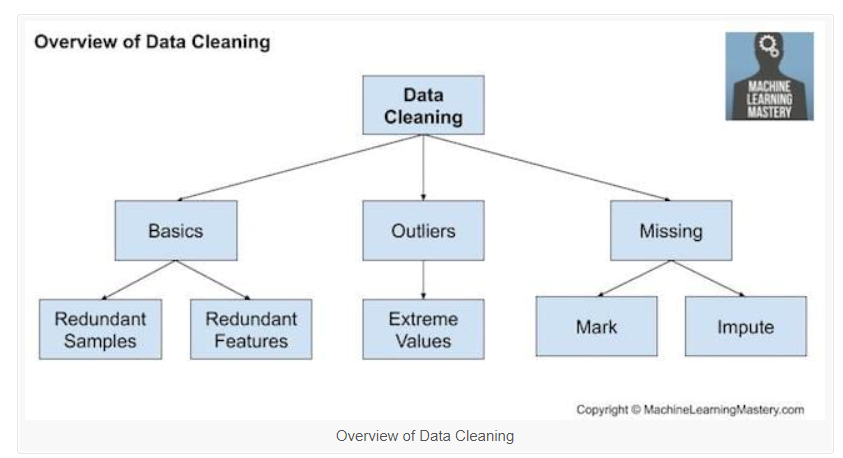

# Resources for data preparation/ cleaning

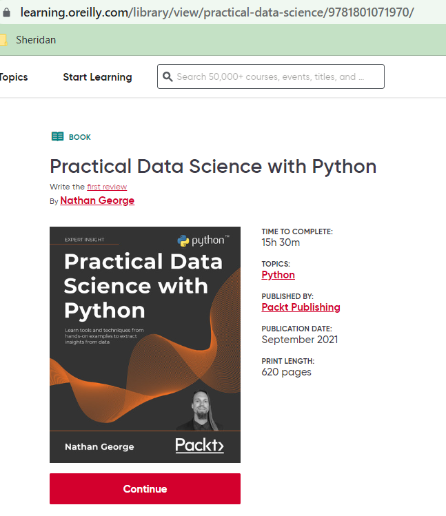

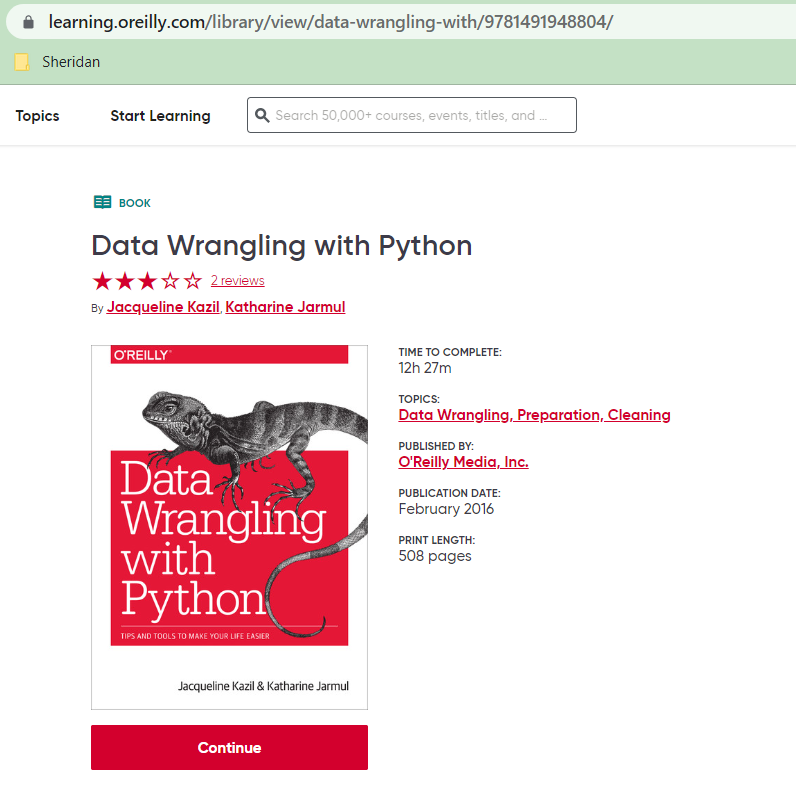

# Data preparation: Feature selection

Feature selection:  is the process of selecting a subset of relevant [features](https://en.wikipedia.org/wiki/Feature_(machine_learning)) (variables, predictors) for use in model construction.

Every model constructed with some features

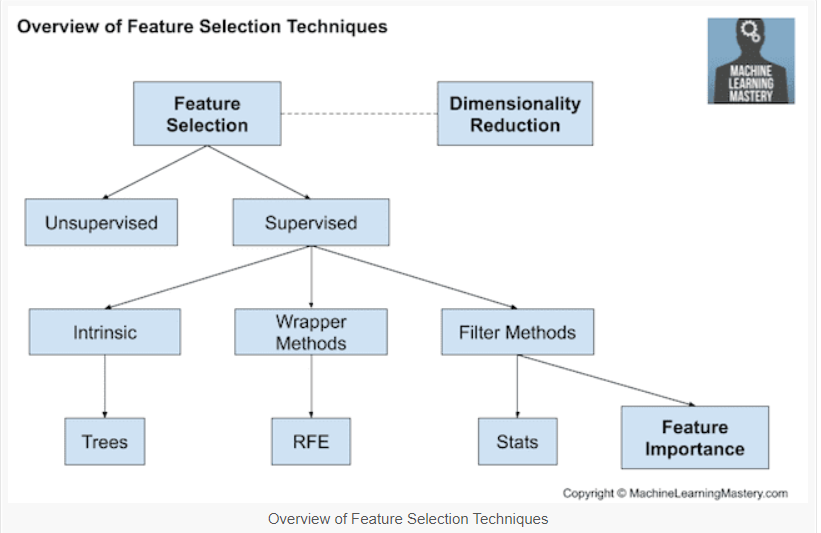

# Training model

# Train a model

* List of some algorithms for model learning:
  * Linear Regression
  * Logistic Regression
  * Decision Tree
  * SVM
  * Naive Bayes
  * kNN
  * K-Means
  * Random Forest

# Evaluation

- Accuracy
- Precision and recall
- Squared error
- Likelihood
- Posterior probability
- Cost / Utility
- Margin
- Entropy
- K-L divergence
- Etc.

# Types of Learning

* __Supervised (inductive) learning__
  * Training data includes desired outputs
* __Unsupervised learning__
  * Training data does not include desired outputs
* __Semi-supervised learning__
  * Training data includes a few desired outputs
* __Reinforcement learning__
  * Rewards from a sequence of actions

https://www.ceralytics.com/3-types-of-machine-learning/

# Supervised Learning

The majority of practical machine learning uses  __supervised__  learning.

In supervised learning, the system tries to learn from the previous examples that are given. (On the other hand, in unsupervised learning, the system attempts to find the patterns directly from the example given.)

Speaking mathematically, supervised learning is where you have both input variables (x) and output variables(Y) and can use an algorithm to derive the mapping function from the input to the output.

_The mapping function is expressed as Y = f(X)._

__Supervised Learning__

When an algorithm learns from example data and associated target responses that can consist of numeric values or string labels, such as classes or tags, in order to later predict the correct response when posed with new examples comes under the category of Supervised learning.

This approach is indeed similar to human learning under the supervision of a teacher. The teacher provides good examples for the student to memorize, and the student then derives general rules from these specific examples.

# Supervised Learning: Uses

Prediction of future cases: Use the rule to predict the output for future inputs

Knowledge extraction: The rule is easy to understand

Compression: The rule is simpler than the data it explains

Outlier detection: Exceptions that are not covered by the rule, e.g., fraud

__Supervised Learning__

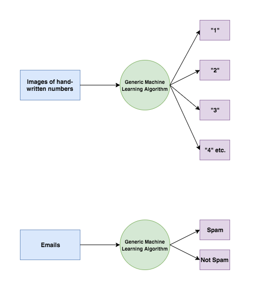

# Categories of Supervised learning

Supervised learning problems can be further divided into two parts, namely  _classification_ , and  _regression_ .

__Classification__ : A classification problem is when the output variable is a category or a group, such as “black” or “white” or “spam” and “no spam”.

__Regression__ : A regression problem is when the output variable is a real value, such as “price” or “height.”

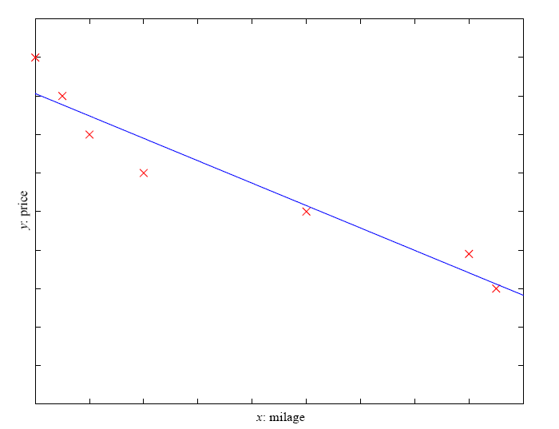

Example: Price of a used car

_x _ : car attributes

_y _ : price

_y _ =  _g _ ( _x _ |  _θ_  )

_g _ ( ) model,

_θ_  parameters

# Prediction: Regression

# Unsupervised Learning

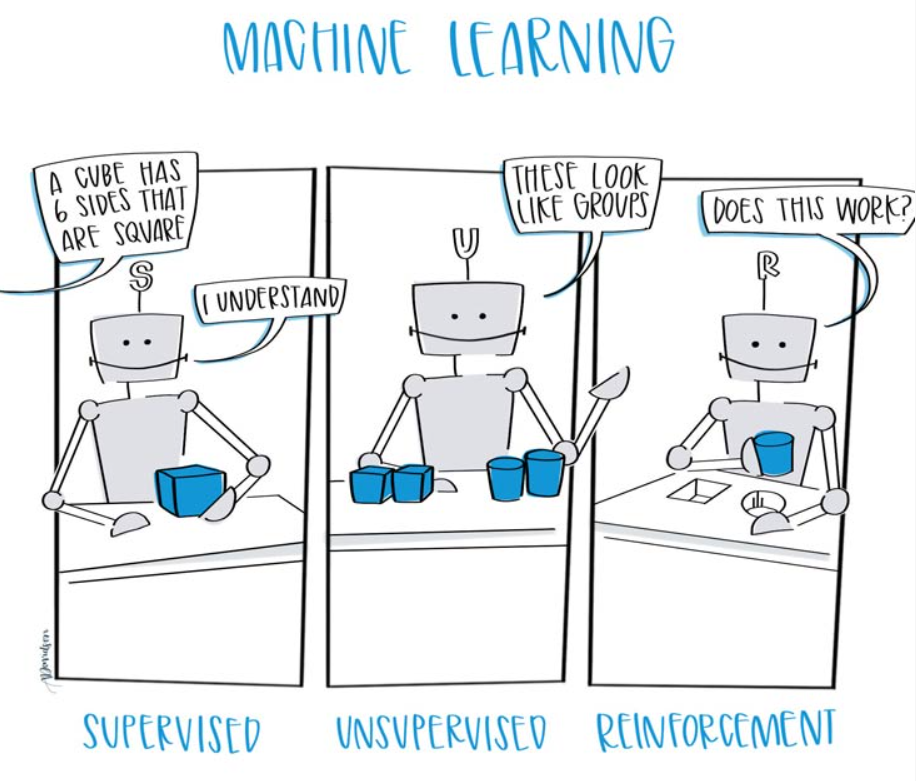

In unsupervised learning, the algorithms are left to themselves to discover interesting structures in the data.

Mathematically, unsupervised learning is when you only have input data (X) and no corresponding output variables.

This is called unsupervised learning because unlike supervised learning above, there are no given correct answers and the machine itself finds the answers.

# Unsupervised Learning (cont.)

* Learning “what normally happens”
* No output
* Clustering: Grouping similar instances
* Other applications: Summarization, Association Analysis
* Example applications
  * Customer segmentation
  * Image compression: Colour quantization
  * Bioinformatics: Learning motifs

# Categories of Unsupervised learning

Unsupervised learning problems can be further divided into  _association_  and  _clustering_  problems.

__Association__ : An association rule learning problem is where you want to discover rules that describe large portions of your data, such as “people that buy X also tend to buy Y”.

__Clustering__ : A clustering problem is where you want to discover the inherent groupings in the data, such as grouping customers by purchasing behavior.

# Learning Associations

Basket analysis:

_P _ ( _Y _ |  _X _ ) probability that somebody who buys  _X_  also buys  _Y _ where  _X_  and  _Y_  are products/services.

Example:  _P _ ( chips | beer ) = 0.7

Market-Basket transactions

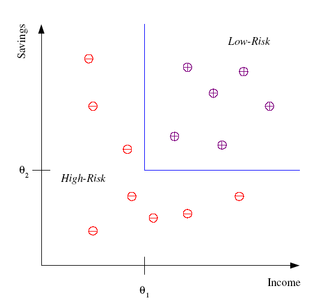

# Classification

Example: Credit scoring

Differentiating between low-risk and high-risk customers from their  _income_  and  _savings_

Discriminant: IF  _income_  > θ1 AND  _savings_  > θ2

THEN low-risk ELSE high-risk

# Classification: Applications

* Pattern recognition
* Face recognition: Pose, lighting, occlusion (glasses, beard), make-up, hair style
* Character recognition: Different handwriting styles.
* Speech recognition: Temporal dependency.
  * Use of a dictionary or the syntax of the language.
  * Sensor fusion: Combine multiple modalities; eg, visual (lip image) and acoustic for speech
* Medical diagnosis: From symptoms to illnesses
* Web Advertising: Predict if a user clicks on an ad on the Internet.

# Face Recognition

Training examples of a person

AT&T Laboratories, Cambridge UK

http://www.uk.research.att.com/facedatabase.html

# Reinforcement Learning

* Topics:
  * Policies: what actions should an agent take in a particular situation
  * Utility estimation: how good is a state (used by policy)
* No supervised output but delayed reward
* Applications:
  * Game playing
  * Robot in a maze
  * Multiple agents, partial observability, ...

# Reinforcement Learning (cont.)

A computer program will interact with a  __dynamic environment __ in which it must perform a particular goal (such as playing a game with an opponent or driving a car). The program is provided feedback in terms of rewards and punishments as it navigates its problem space.

Using this algorithm, the machine is trained to make specific decisions. It works this way: the machine is exposed to an environment where it continuously trains itself using trial and error method.

Here learning data gives feedback so that the system adjusts to dynamic conditions in order to achieve a certain objective. The system evaluates its performance based on the feedback responses and reacts accordingly. The best-known instances include self-driving cars and the chess master algorithm AlphaGo.

# Semi-supervised learning

If some learning samples are labelled, but some others are not labelled, then it is semi-supervised learning. It makes use of a large amount of  __unlabeled data for training __ and a small amount of  __labelled data for testing__ . Semi-supervised learning is applied in cases where it is expensive to acquire a fully labelled dataset while more practical to label a small subset.

# Why Machine Learning with Python

Python is popular for research and development of production systems. It is a vast language with number of modules, packages and libraries that provides multiple ways of achieving a task.

Python and its libraries like NumPy, Pandas, SciPy, Scikit-Learn, Matplotlib are used in data science and data analysis. They are also extensively used for creating scalable machine learning algorithms.

Python implements popular machine-learning techniques such as Classification, Regression, Recommendation, and Clustering.

Python offers ready-made framework for performing data mining tasks on large volumes of data effectively in lesser time

# Libraries and Packages

* To understand machine learning, you need to have basic knowledge of Python programming. In addition, there are a number of libraries and packages generally used in performing various machine learning tasks as listed below:
  * _numpy_  _ _  _- is used for its N-dimensional array objects_
  * _pandas _  _– is a data analysis library that includes _  _dataframes_
  * _matplotlib_  _ _  _– is 2D plotting library for creating graphs and plots_
  * _scikit_  _-learn _  _- the algorithms used for data analysis and data mining tasks_
  * _seaborn_  _ _  _– a data visualization library based on _  _matplotlib_

# Support Vector Machines

# Intuitions

# A “Good” Separator

# Noise in the Observations

# Ruling Out Some Separators

# Maximizing the Margin

# “Fat” Separators

# Support Vectors

# The Math

* Training instances
  * x  n
  * y  {-1, 1}
* Decision function
  * f(x) = sign(<w,x> + b)
  * w  n
  * b  
* Find w and b that
  * Perfectly classify training instances
    * Assuming linear separability
  * Maximize margin

# The Math (cont.)

* For perfect classification, we want
  * yi (<w,xi> + b) ≥ 0 for all i
  * Why?
* To maximize the margin, we want
  * w that minimizes |w|2

# Strengths of SVMs

- Good generalization in theory
- Good generalization in practice
- Work well with few training instances
- Find globally best model
- Efficient algorithms
- Amenable to the kernel trick

